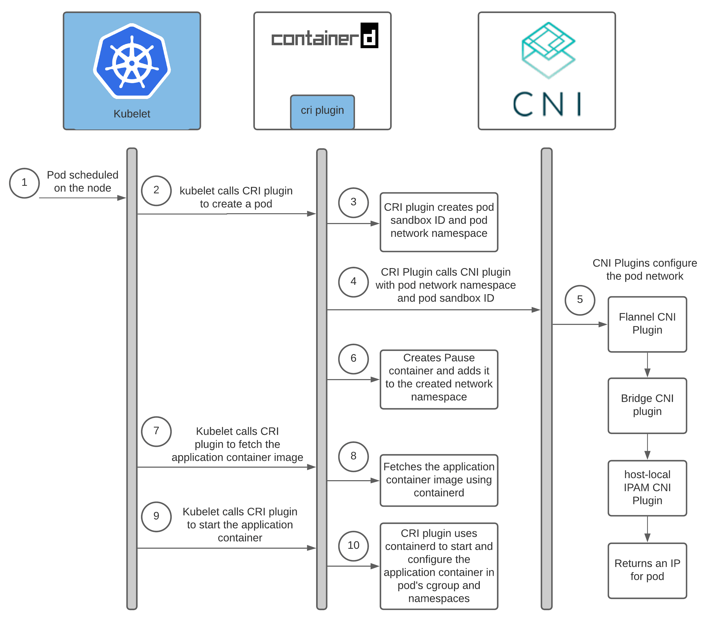
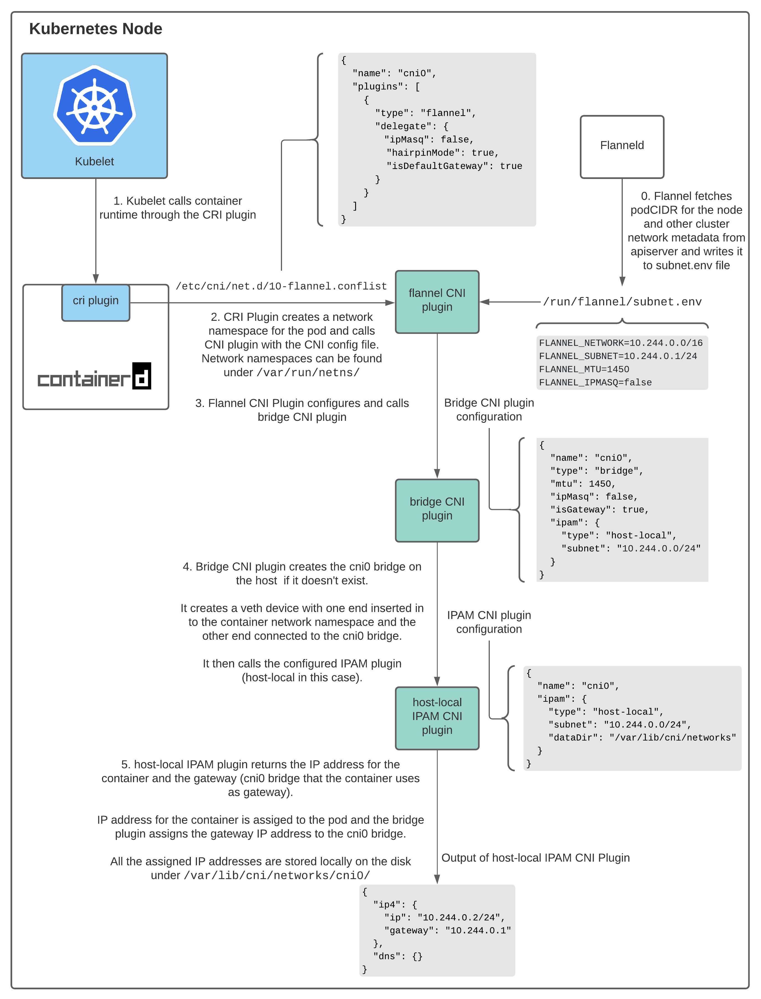

# 如何开发一款CNI插件

## 目标

+ 了解CNI工作原理
+ 开发一个简单的CNI插件

## 背景知识

### CNI是什么

CNI（Container Network Interface）是一个用于容器网络管理的接口规范，它定义了如何为容器配置和操作网络。通过实现这个接口，可以创建各种类型的网络插件来满足不同的需求。

### 为什么需要CNI

在容器化环境中，每个容器都需要一个独立的IP地址和网络环境。CNI提供了一种标准化的方式来实现这一功能，使得不同厂商的容器运行时（如Docker、Kubernetes等）能够使用相同的网络管理策略。

## CNI的工作原理

### CNI与kubernetes交互

下面一张图展现了CNI插件在Kubernetes中的工作流程：

下图是flannel插件的工作原理：

+ **插件发现**：当容器启动时，容器运行时首先会查找并加载CNI配置文件，这些文件通常位于`/etc/cni/net.d/`目录下。
+ **执行插件**：根据CNI配置文件中指定的网络类型，容器运行时将调用相应的CNI插件二进制程序。
+ **网络配置**：CNI插件负责为容器分配IP地址、设置路由规则以及进行其他必要的网络配置工作。
+ **返回结果**：完成网络配置后，CNI插件会将配置信息以JSON格式返回给容器运行时，其中包括容器的IP地址等信息。
+ **清理资源**：当容器停止或删除时，CNI插件会执行相应的清理操作，如释放IP地址、删除路由规则等。

1. Pod内部的容器通信

pause容器：

netns: 

2. 同一节点上Pod间通信

3. 不同节点上Pod间通信

4. Pod与Service通信
