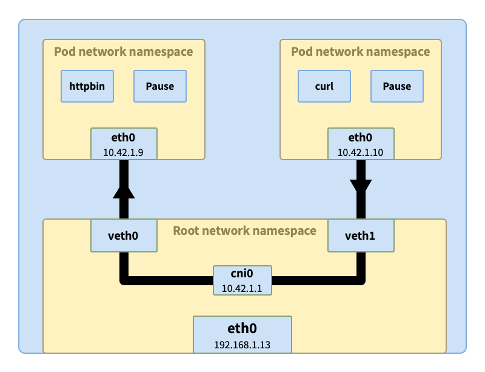
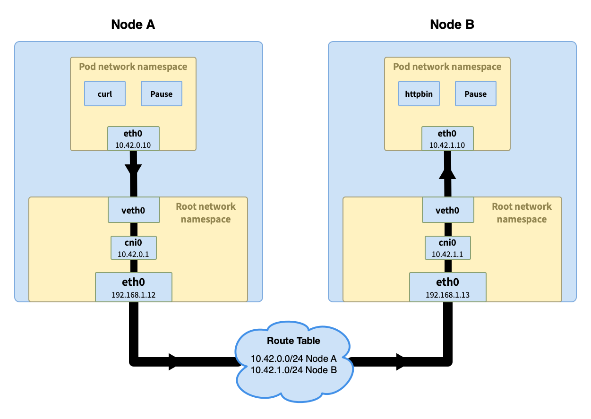

# 如何开发一款kubernetes CNI插件

**目标:**

1. 了解kubernetes的网络模型
2. 了解CNI的工作机制
3. 掌握CNI插件的开发与部署

## 背景知识

### 历史背景

CNI的发展历程反映了容器网络技术的演进：

+ ​​早期混乱期​​：在容器技术早期，每个容器平台(如Docker、Kubernetes、Mesos)都有自己的网络实现方式，导致网络解决方案需要为每个平台单独适配，造成大量重复工作。  

+ ​CNI的诞生​​：CNI最初由CoreOS在2015年提出，目的是为容器网络提供一个通用的接口标准。它从rkt的网络模型中发展而来，后来得到了包括Kubernetes在内的多个容器平台的支持。

+ 与CNM的竞争​​：Docker提出了自己的网络模型CNM(Container Network Model)，但CNM设计更为复杂且专为Docker定制，难以支持其他容器运行时。相比之下，CNI更加轻量和通用，最终被Kubernetes采纳为标准。

+ ​Kubernetes的采用​​：随着Kubernetes的崛起（k8s从1.5版本开始集成CNI），CNI因其简单性和灵活性成为Kubernetes事实上的网络标准。Kubernetes通过CNI接口将网络功能外包给专门的网络插件。

+ ​​持续演进​​：CNI规范经过多次迭代，从最初的简单功能发展到支持更复杂的网络场景，如网络策略、服务发现等。

+ ​​生态系统繁荣​​：随着CNI被广泛接受，出现了大量CNI插件实现，如Calico、Flannel、Weave、Cilium等，每种插件针对不同的使用场景进行了优化

### 什么时CNI

1. CNI是一个二进制程序，放置在主机上
2. CNI只有在Pod创建或者销毁时才被调用


## 技术原理

### 基础原理

+ 网络模型（二层网络、三层网络）
+ kubernetes网络模型
+ 基础概念（AI整理报告）
+ TCP/IP 数据包封装过程（了解）

### CNI的运行机制

CNI 最主要作用是处理Pod的网络配置问题

### k8s 网络模型

该模型定义了：

+ 每个 pod 都有自己的 IP 地址，这个 IP 在集群范围内可达
+ Pod 中的所有容器共享 pod IP 地址（包括 MAC 地址），并且容器之前可以相互通信（使用 localhost）
+ Pod 可以使用 pod IP 地址与集群中任一节点上的其他 pod 通信，无需 NAT
+ Kubernetes 的组件之间可以相互通信，也可以与 pod 通信
+ 网络隔离可以通过网络策略实现

### Kubernetes网络是如何工作的

### Pod内部容器间通信

kubernetes是由一个个Pod组成的服务编排系统，每个Pod相互独立，如何保证Pod的独立性： 

linux namespace -> net namespace

+ Pod是如何创建网络
+ Pod内部网络的特点

如果Pod里面的网络要访问宿主机，怎么办？ 

引出概念： veth pair

什么是`veth pair`？

veth pair 类似于一条网线，连接两端（容器内部和主机）

`veth pair`作用是啥？ 

`veth pair`怎么使用？ 

### 同节点上Pod的通信

当我们将 curl 容器和 httpbin 分别在两个 pod 中运行，这两个 pod 有可能调度到同一个节点上。curl 发出的请求根据容器内的路由表到达了 pod 内的 eth0 接口。然后通过与 eth0 相连的隧道 veth1 到达节点的根网络空间。

veth1 通过网桥 cni0 与其他 pod 相连虚拟以太接口 vethX 相连，网桥会询问所有相连的接口是否拥有原始请求中的 IP 地址（比如这里的 10.42.1.9）。收到响应后，网桥会记录映射信息（10.42.1.9 => veth0），同时将数据转发过去。最终数据经过 veth0 隧道进入 pod httpbin 中



### 不同节点Pod的通信



所使用到的技术:

+ VxLAN 
+ BGP
+ IPIP
+ Geneve

### Pod to Service

## 开发与部署

### CNI介绍

CNI tool 是用来管理容器网络接口的工具，它通过插件的形式提供各种网络功能。CNI 插件通常以二进制文件形式存在，并被放置在宿主机的特定目录下（通常是 /opt/cni/bin）。

+ IPAM: 负责IP地址分配与管理，如 IPAM 插件可以为容器分配和回收 IP 地址。
+ Main: 
+ Meta: 

### 开发准备与流程

日志打印（调试用）：

```go
var l *log.Logger
```

### 配置与部署

部署配置:
```json
{
    "cniVersion": "0.3.1",
    "name": "mynet",
    "plugins": [
        {
            "type": "mycni",
            "subnet": "10.40.0.0/16",
            "gateway": "10.40.0.1",
            "dataDir": "/var/lib/cni"
        }
    ]
}
```

配置文件一般放在 `/etc/cni/net.d` 目录下，文件名类似 `10-mynet.conf`，也可以通过kubelet参数指定
```
kubelet --network-plugin=cni --cni-conf-dir=/etc/cni/net.d --cni-bin-dir=/opt/cni/bin
```

返回参数:
```json
{
  "cniVersion": "0.2.0",
  "code": 1,
  "msg": "CNI version not supported"
}
```

使用CNI官方提供工具配置网络:
```json
{
    "cniVersion": "0.3.1",
    "name": "mynet",
    "plugins": [
        {
            "type": "bridge",
            "bridge": "cni0",
            "isGateway": true,
            "ipMasq": true,
            "ipam": {
                "type": "host-local",
                "subnet": "10.40.0.0/16",
                "rangeStart": "10.40.0.2",
                "gateway": "10.40.0.1"
            }
        },
        {
            "type": "portmap",
            "capabilities": {
                "portMappings": true
            }
        },
        {
            "type": "vxlan",
            "capabilities": {
                "macvsip": true
            }
        }
    ]
}
```

### 问题

1. 如果有新的节点加入，怎么能更新本地路由？

## 总结

### 当前主流的CNI插件技术风格