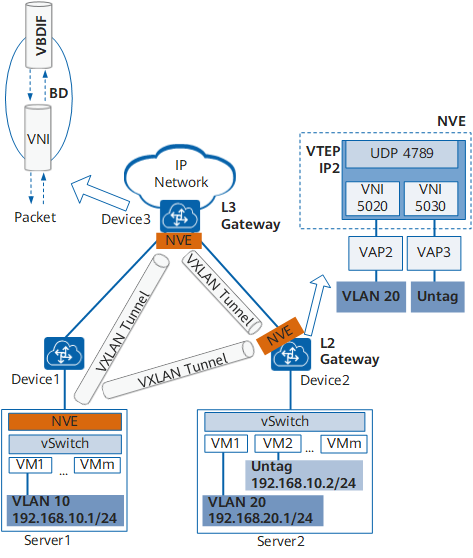

# VXLAN

## 概念

VXLAN（Virtual eXtensible Local Area Network，虚拟扩展局域网），是由IETF定义的NVO3（Network Virtualization over Layer 3）标准技术之一，是对传统VLAN协议的一种扩展。通过将虚拟机发出的数据包封装在UDP中，并使用物理网络的IP、MAC作为outer-header进行封装，然后在IP网络上传输，到达目的地后由隧道终结点解封装并将数据发送给目标虚拟机。VXLAN的特点是将L2的以太帧封装到UDP报文（即L2 over L3， 或者Mac in UDP）中，并在L3网络中传输。

## VxLAN 工作原理

在介绍VXLAN隧道的建立过程前，先来了解VXLAN网络模型中一些常见的概念。如下图所示，两台服务器之间通过VXLAN网络进行通信。在两台TOR交换机之间建立了一条VXLAN隧道，TOR交换机将服务器发出的原始数据帧加以“包装”，好让原始报文可以在承载网络（比如IP网络）上传输。当到达目的服务器所连接的TOR交换机后，离开VXLAN隧道，并将原始数据帧恢复出来，继续转发给目的服务器。



优点是什么？ 

缺点是什么？

## VxLAN与VLAN有什么不同

VLAN作为传统的网络隔离技术，在标准定义中VLAN的数量只有4000个左右，无法满足大二层网络的租户间隔离需求。另外，VLAN的二层范围一般较小且固定，无法支持虚拟机大范围的动态迁移。

VXLAN完美地弥补了VLAN的上述不足，一方面通过VXLAN中的24比特VNI字段，提供多达16M租户的标识能力，远大于VLAN的4000；另一方面，VXLAN本质上在两台交换机之间构建了一条穿越基础IP网络的虚拟隧道，将IP基础网络虚拟成一个巨型“二层交换机”，即大二层网络，满足虚拟机大范围动态迁移的需求。

虽然从名字上看，VXLAN是VLAN的一种扩展协议，但VXLAN构建虚拟隧道的本领已经与VLAN迥然不同了。

VxLAN的报文结构：


如上图所示，VTEP对VM发送的原始以太帧（Original L2 Frame）进行了以下“包装”：

+ VXLAN Header
增加VXLAN头（8字节），其中包含24比特的VNI字段，用来定义VXLAN网络中不同的租户。此外，还包含VXLAN Flags（8比特，取值为00001000）和两个保留字段（分别为24比特和8比特）。

+ UDP Header
VXLAN头和原始以太帧一起作为UDP的数据。UDP头中，目的端口号（VXLAN Port）固定为4789，源端口号（UDP Src. Port）是原始以太帧通过哈希算法计算后的值。

+ Outer IP Header
封装外层IP头。其中，源IP地址（Outer Src. IP）为源VM所属VTEP的IP地址，目的IP地址（Outer Dst. IP）为目的VM所属VTEP的IP地址。

+ Outer MAC Header
封装外层以太头。其中，源MAC地址（Src. MAC Addr.）为源VM所属VTEP的MAC地址，目的MAC地址（Dst. MAC Addr.）为到达目的VTEP的路径中下一跳设备的MAC地址。

**什么是VXLAN VTEP**

VTEP（VXLAN Tunnel Endpoints，VXLAN隧道端点）是VXLAN网络的边缘设备，是VXLAN隧道的起点和终点，源服务器发出的原始数据帧，在VTEP上被封装成VXLAN格式的报文，并在IP网络中传递到另外一个VTEP上，并经过解封转还原出原始的数据帧，最后转发给目的服务器。

**什么是VXLAN VNI**

VNI（VXLAN Network Identifier，VXLAN 网络标识符），VNI是一种类似于VLAN ID的用户标识，一个VNI代表了一个租户，属于不同VNI的虚拟机之间不能直接进行二层通信。

VNI还可分为二层VNI和三层VNI，它们的作用不同，二层VNI是普通的VNI，用于VXLAN报文同子网的转发；三层VNI和VPN实例进行关联，用于VXLAN报文跨子网的转发。

### VxLAN 网关

和VLAN类似，不同VNI之间的主机，以及VXLAN网络和非VXLAN网络中的主机不能直接相互通信。为了满足这些通信需求，VXLAN引入了VXLAN网关的概念。VXLAN网关分为二层网关和三层网关，VXLAN二层网关用于终端接入VXLAN网络，也可用于同一VXLAN网络的子网通信；VXLAN三层网关用于VXLAN网络中跨子网通信以及访问外部网络。

## VxLAN 隧道建立

创建VxLAN设备

```
ip link add vxlan01 type vxlan id 100 dstport 4789 remote 10.10.18.160 local 10.10.18.158 dev enp1s0
```

**参数解释:**

+ id: 指定VNI值，有效值在`1 ~ 2^24`之间
+ dstport: VTEP通信端口， IANA分配的端口是4789，如果不指定， Linux默认使用`8472`，ovs创建vxlan port默认使用 4789
+ remote: 对端VTEP的地址，一般使用物理机上的网卡最为VTEP指定的IP地址
+ local: 当前节点VTEP使用的地址，一般为当前物理机上的网卡IP地址
+ dev: 当前节点用于VTEP通信的设备，一般指定为本机的网卡，用来获取VTEP IP地址。这个参数与local参数目的相同，二选一即可。

创建完成后可以通过下面命令查看:

```shell
ip link show type vxlan
```
输出:
```shell
localhost@localhost:~$ ip link show type vxlan
6: vxlan01: <BROADCAST,MULTICAST> mtu 1450 qdisc noop state DOWN mode DEFAULT group default qlen 1000
    link/ether 42:03:15:46:68:d2 brd ff:ff:ff:ff:ff:ff
```

同时vxlan创建完成后，会增加一条bridge FDB转发表:
```
bridge fdb
```
输出:
```shell
00:00:00:00:00:00 dev vxlan01 dst 10.10.18.160 via enp1s0 self permanent
```

**注意:** 

+ 在使用VxLAN时，最好把主机的防火墙关闭。

## 实战： 手动创建VxLAN实现点对点虚拟网络通信

